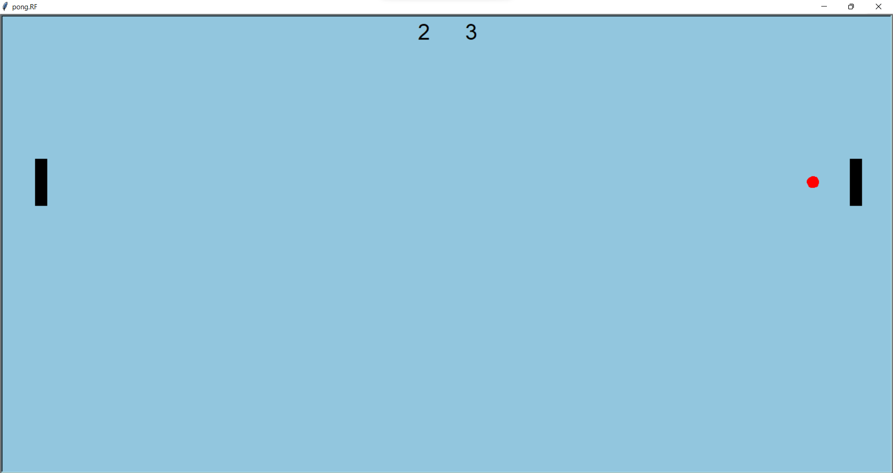

# 🏓 Simple Pong Game

A classic Pong implementation using Python's Turtle graphics library.

## Features
- Two-player local multiplayer
- Score tracking
- Collision detection
- Keyboard controls

## Requirements
- Python 3.x
- Turtle module (standard library)

## How to Play

▶️ **Run:** `python main.py`

🕹️ **Controls:**
- Left: W/S keys
- Right: ↑/↓ arrows
